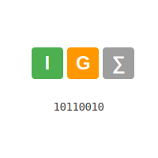

# Information Gain-based Word Puzzle Solver




An intelligent AI-VS-Words solver that uses Information Theory and Decision Trees to make optimal guesses. This implementation uses Information Gain to strategically reduce the solution space and find the target word efficiently.

## AI Classification

This solver implements multiple AI paradigms:

1. **Information-Theoretic Agent**
   - Uses entropy and information gain to measure uncertainty and make decisions
   - Quantifies the informativeness of each possible guess
   - Employs Shannon's Information Theory principles for optimal decision making

2. **Model-Based Agent**
   - Maintains an internal model of possible solutions
   - Updates its knowledge base after each guess
   - Uses feedback to refine its understanding of the solution space

3. **Goal-Based Agent**
   - Has a clear goal state (finding the correct word)
   - Makes decisions to minimize the number of guesses needed
   - Uses heuristic evaluation to choose optimal actions

4. **Utility-Based Components**
   - Maximizes information gain with each guess
   - Balances exploration (gathering information) with exploitation (making educated guesses)
   - Uses probability theory to evaluate the utility of each possible action

## Features

- **Information Theory-based approach**: Uses entropy and information gain to make optimal word guesses
- **Smart Word Filtering**: Maintains a consistent solution space based on previous guesses and feedback
- **Flexible Parameters**: Configurable word length and maximum number of guesses
- **Custom Word Lists**: Supports custom dictionary files with proper noun handling
- **Detailed Feedback**: Provides comprehensive feedback on each guess with uppercase (correct position), lowercase (wrong position), and underscore (not in word) notation

## How It Works

The solver uses Information Theory principles to make intelligent guesses:

1. **Information Gain Calculation**: For each potential guess, calculates how much information would be gained by making that guess
2. **Pattern Analysis**: Analyzes potential feedback patterns to determine which guess would best split the remaining solution space
3. **Solution Space Reduction**: After each guess, filters the word list to maintain only consistent candidates
4. **Optimal Selection**: Chooses the guess that maximizes information gain for the next iteration

## Installation

1. Clone the repository:
```bash
git clone https://github.com/faycalki/AI-VS-Words-ai-solver.git
cd AI-VS-Words-ai-solver
```

2. Ensure you have the required dependencies:
```bash
python -m pip install math random string
```


## Usage

### Command Line Interface

```python
# Import the solver
from aivswords_backend import word_ig_solver, make_word_list

# Create a word list
word_list = make_word_list("linuxwords.txt", n_letters=5, allow_proper_noun=False)

# Solve a puzzle
result = word_ig_solver(word_list, "tesla", n_guesses=6)
print(result)
```

### Streamlit Interface

We provide a user-friendly web interface built with Streamlit that visualizes the solver's decision-making process.

#### Installation

1. Install additional requirements:
```bash
pip install streamlit pandas plotly
```

2. Launch the interface:
```bash
streamlit run aivswords_backend.py
```

#### Features

The Streamlit interface provides:


1. **Interactive Input**
   - Enter any 5-letter target word
   - Start new games with a single click
   - Real-time feedback on input validity

2. **Live Statistics**
   - Remaining possible words
   - Number of guesses made
   - Current entropy of solution space
   - Information gain from each guess

3. **Visualizations**
   - Letter distribution charts
   - Solution space analysis
   - Guess history with detailed metrics

4. **Game History**
   - Complete record of all guesses
   - Feedback patterns for each guess
   - Performance metrics

#### How to Play

1. **Start the Application**
   ```bash
   streamlit run aivswords_backend.py
   ```

2. **Enter a Target Word**
   - Type any 5-letter word in the input field
   - The word will be validated automatically

3. **Make Guesses**
   - Click "Make Guess" to let the solver try to find your word
   - Watch the solution space narrow with each guess
   - See the information gain from each decision

4. **Analyze Performance**
   - View detailed statistics about the solver's performance
   - Understand the decision-making process
   - See how information theory guides the choices

#### Example Session


The image above shows a typical solving session where:
1. The solver starts with the full dictionary
2. Each guess provides information gain
3. The solution space narrows progressively
4. Statistics update in real-time

#### Tips for Using the Interface

1. **Optimal Performance**
   - Use common English words for best results
   - The solver works best with standard dictionary words
   - Proper nouns may not be in the default dictionary

2. **Understanding the Display**
   - Blue tiles: Correct letter, correct position
   - Yellow tiles: Correct letter, wrong position
   - Gray tiles: Letter not in word

3. **Analysis Tools**
   - Use the entropy display to understand uncertainty
   - Watch the solution space visualization
   - Review guess history for patterns


### Configuration Parameters

- `n_letters`: Number of letters in the target word (default: 5)
- `n_guesses`: Maximum number of allowed guesses (default: 6)
- `allow_proper_noun`: Whether to include proper nouns in the word list (default: False)

## Example Output

```
Remaining guesses: 6, Current solution space: 2315 words.
Trying guess: stare
Remaining guesses: 5, Current solution space: 123 words.
Trying guess: point
Remaining guesses: 4, Current solution space: 15 words.
Trying guess: tesla
You won! The statistics are: Best guess: tesla, Number of guesses: 3, Guesses made: ['stare', 'point', 'tesla']
```

## Functions

### `AI-VS-Words_ig_solver(X, solution, n_guesses)`
Main solver function that implements the information gain-based approach.

### `make_word_list(wordlist_fname, n_letters, allow_proper_noun=False)`
Generates a filtered word list from a dictionary file.

### `check_letters(solution, guess)`
Provides feedback on a guess using the standard AI-VS-Words notation.

### `simulate_guess_patterns(guess, X)`
Simulates potential feedback patterns for a given guess.

### `calculate_entropy(X)`
Calculates the entropy of the current solution space.

### `information_gain(E, E_subset)`
Calculates the information gain from a potential guess.


## Complexity Analysis

### Time Complexity: O(W²L)

The algorithm's time complexity is O(W²L) where:
- W = number of words in the solution space
- L = length of each word


#### Component Breakdown:
1. **Main Loop**: O(W²)
   - Evaluates each potential guess against all possible solutions
2. **Pattern Simulation**: O(WL)
   - Generates feedback patterns for each word comparison
3. **Letter Checking**: O(L)
   - Compares individual letters for pattern generation

### Space Complexity: O(W)

The space complexity is linear with respect to the input size:
- **Solution Space**: O(W) for storing valid words
- **Pattern Dictionary**: O(W) for storing pattern frequencies
- **History & Clues**: O(1) constant space for game state

### Performance Characteristics

1. **Initial Computation**
   - Highest complexity at start (full word list)
   - W ≈ 2315 for standard English AI-VS-Words

2. **Progressive Optimization**
   - Solution space shrinks after each guess
   - Time complexity improves with each iteration

3. **Memory Efficiency**
   - Linear space complexity ensures memory efficiency
   - Constant auxiliary space for game mechanics

### Optimization Notes

1. **Time Optimizations**
   - Pattern memoization
   - First-guess caching
   - Early termination checks

2. **Space Optimizations**
   - Dynamic solution space reduction
   - Efficient pattern storage
   - Minimal state tracking


## Further considerations on Performance

The solver typically finds the solution in 3-5 guesses for most target words in the standard English dictionary. Performance may vary based on:
- Initial word list size
- Target word complexity
- Number of allowed guesses
The time complexity of this algorithm is $O(n^2)$

## Future Improvements

- [ ] Implement parallel processing for faster guess evaluation
- [ ] Add support for custom scoring metrics
- [ ] Optimize initial guess selection
- [ ] Add visualization of the decision tree process
- [ ] Implement caching for common patterns
- [ ] Implement Player(S) VS AI play choice with multiple settings
- [ ] Implement Different dictionary choices from frontend with different number of guesses and number of letters.
  - Implement different guesses for players and other settings for difficulty
- [ ] Implement visual effects, sound effects, and mobile version
- [ ] Publish on Steam

## Contributing

Contributions are welcome! Please feel free to submit a Pull Request. For major changes, please open an issue first to discuss what you would like to change.

## License

This project is licensed under the GNU License - see the [LICENSE](LICENSE) file for details.

## Acknowledgments and Credits

- Original implementation by Faycal Kilali
- Certain methods provided by Dr. Michael Cormier
- Based on Information Theory Principles 
- Inspired by Hangman and other Word-based Puzzle games.


